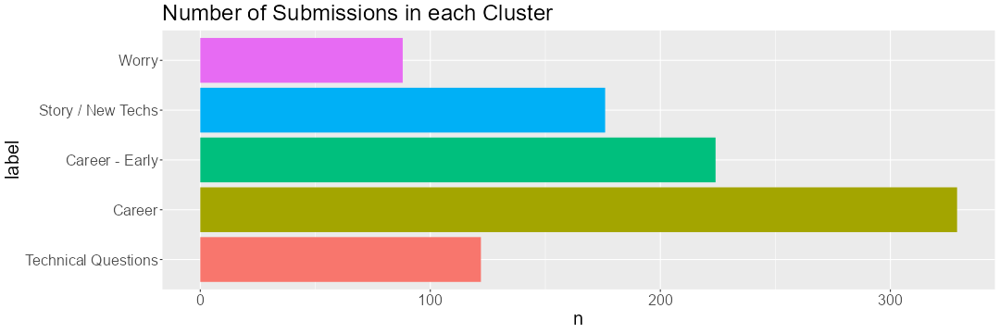
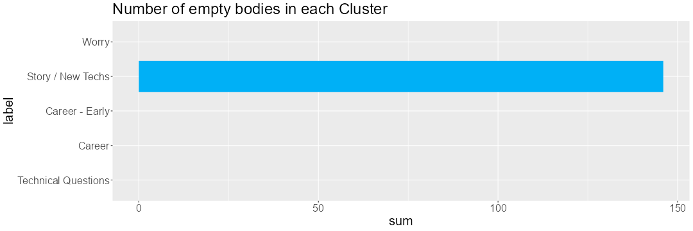
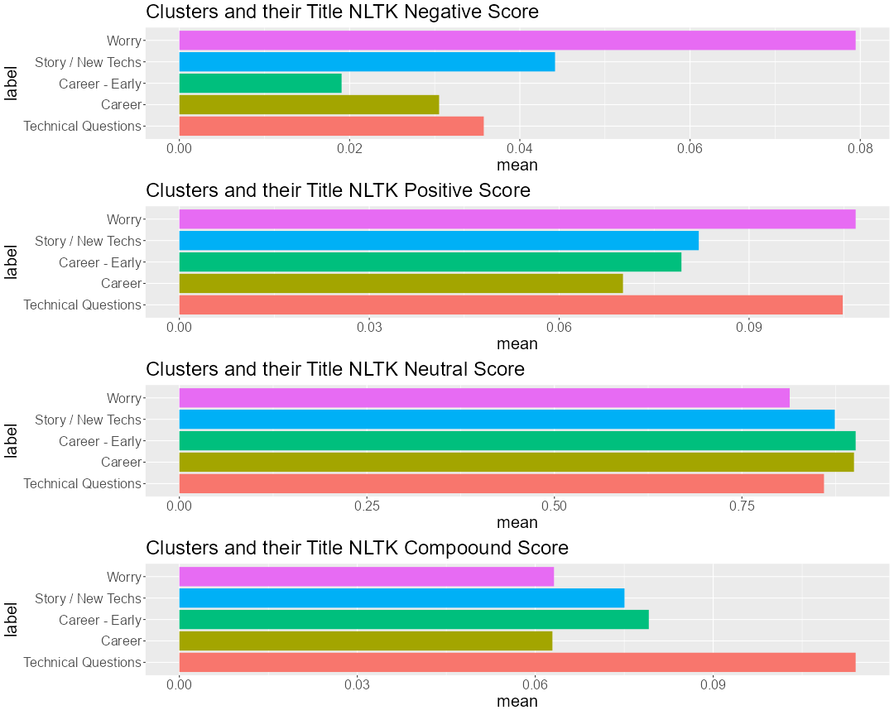
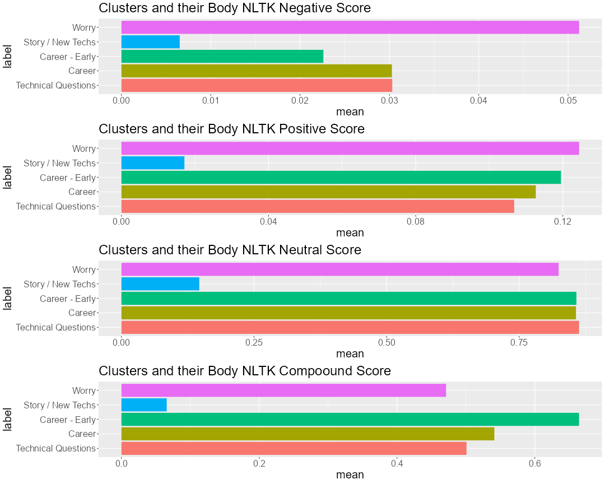
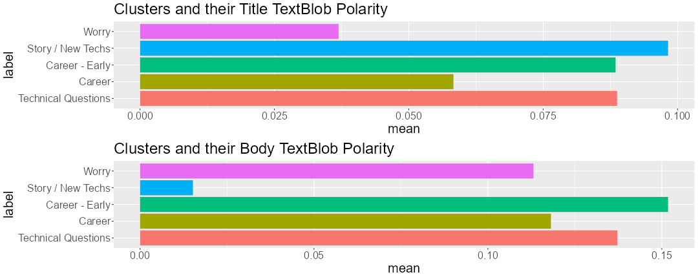
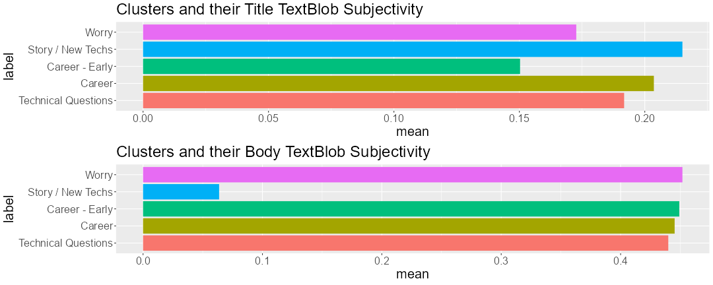
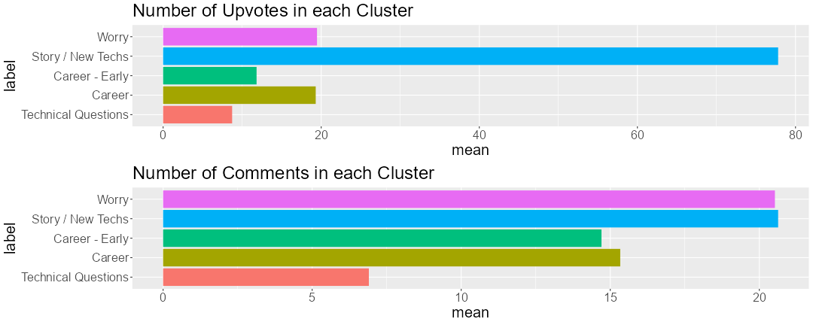

# ds-on-rdatascience

Author: Morris CHAN

## Background

Topic modelling is a useful machine learning technique for researchers to study latent structure of a set of texts. As an active user of reddit and a member of the subreddit [r/datascience](https://www.reddit.com/r/datascience/), I am curious if there are any common topics in the submissions in the public forum and whether these topics are associated with any patterns in the submission content and users' behavior (e.g., upvotings).

To start my investigation, I tried [`PRAW: The Python Reddit API Wrapper`](https://praw.readthedocs.io/en/stable/) to scrape reddit contents. Topic modelling is performed with [`SentenceTransformers`](https://www.sbert.net/) built with the Siamese BERT-Networks and [`SciPy`](https://scipy.org/). [`Natural Language Toolkit (ntlk)`](https://www.nltk.org/) and [`TextBlob`](https://textblob.readthedocs.io/en/dev/) were used to study user behavior by extracting semantic features of the post contents.

## Methodology

While PRAW has a limitation of 1,000 submissions, I only fetched a thousand of posts from the subreddit. I ran the script on 26th February. Unfortunately, most of the submissions are new and are not with much comments. This may reduce the robustness of any inference on user behaviors.

Topic modelling was done by clustering submissions. While all the posts are in text format, it is necessary to transform the data into numeric format that is useable in clustering algorithms. I transformed the text data into embeddings with `SentenceTransformers` on the posts' title and posts' content. Both embeddings were then combined and passed to SciPy's hierarchical clustering function.

At the end, I explored the sentiments, number of upvotes (i.e. `Like` in reddit), and number of comments of each cluster.

## Results

### Clustering

By manually testing with different numbers of clusters, clustering with 5 groups of submissions was deemed optimum.

The first cluster mostly contains submissions with questions on technical issues of data science. Here are some of the submissions' title in this cluster: `Interview - Which models to compare LightGBM with?`, `Regression and Time Series`, `Handling mislabeled tabular data with xgboost`. I named this cluster as `Technical Questions`. This cluster contains 122 post submissions.

The second cluster mostly contains submissions regarding the career aspect of data science. Here are some of the submissions' title in this cluster: `Hired by a company as the sole data scientist. The management does not understand what data science is, but want to say they are doing it. Anyone else experiencing this?`, `Data science, analyst carrer Eastern EU`, `Leap from Senior Data Analyst to Data Scientist (again?)`, `What was the most interesting stuff you did as a Data scientist?`. I named this cluster as `Career`. This cluster contains 329 post submissions.

The third cluster is very similar to those in the cluster `Career`. It also contains submissions regarding the career aspect of data science. However, by manually comparing contents of post submissions in cluster `Career` and this cluster, it was reviewed that posts here are more concerning with entering the field and early career. Here are some of the submissions' title in this cluster: `Is having a degree in Economics with a specialization in quantitative analysis enough to become a data scientist?`, `Having a rough time finding an entry level position to get into the industry`, `I'm going to start my first ML job next week, what should I expect?`, `Why is it so hard to get internships?`. I named this cluster as `Career - Early` to differentiate this from the cluster `Career`. This cluster contains 224 post submissions.

It is not easy to label the forth cluster because the topics of submissions in this cluster are not very narrow as the previous 3 clusters. Here are some of the submissions' title in this cluster: `Text To MUSIC? Google Creates AI Bot That Writes Music Based on Text Descriptions...`, `Creating Real-World AI Models by Newbies With ChatGPT`, `Do you cuss while at work?`, `Anyone have valentine meme/puns related to data or tech? I'm looking for a funny or creative one!!`. To summarize, they are not very technical but more about advancement in machine learning or some fun exeriences. I named this cluster as `Story / New Techs`. This cluster contains 176 post submissions.

The fifth cluster is also with some subjective experience and they are mostly negative. Here are some of the submissions' title in this cluster: `not a good fit`, `Confidence in my approach.`, `Discouraged`, `A module my project depended on to retrieve data is obsolete. Still include project in portfolio?`. I named this cluster as `Worry`. This cluster contains 88 post submissions.

> Image 1: Number of submissions

While reddit allows user to create posts without any content in the body (i.e., just the title), it is necessary to investigate how many posts in each cluster are with an empty body. It is found that only cluster `Story / New Techs` is with posts they are without any body text.

> Image 2: Number of submissions with an empty body

### Sentiment

`SentimentIntensityAnalyzer` returns 4 scores for each observation. The first 3 scores correspond to the negativity, positivity, neutrality. Higher scores indicate higher intensity in that sentiment dimension. The compound score is a single metric to represent the sentiment, ranging from -1 (most negative) to 1 (most positive).

While the titles of `Worry` are with the highest average negative sentiment score, they are also with the highest positive score. Still, the contrast is sharper when compare the negative sentiment of all clusters. `Career` has an opposite pattern: low negative sentiment and with the lowest positive sentiment. These 2 clusters are the ones with the lowest compound scores for their titles.

> Image 3: Sentiment Scores for the Titles

The same sentiment analysis was run on the post submissions' content.

First, it should be noted that the low scores in `Story / New Techs` are due to the existence of empty post bodies. It pulls down the average sentiment score as empty texts are with no sentiments. Posts in `Worry` are also with the highest negative and positive scores. A different pattern is observed with the compound score as now almost all (except `Story / New Techs`) are with scores much higher in the post body (around 0.8) than in the post title (around 0.06).

> Image 4: Sentiment Scores for the Bodies

The polarity returned by `TextBlob` is ranging from -1 (most negative) to 1 (most positive). While there seems to be a significant difference between each cluster, it should be noted that the average of each cluster are so close to 0 such that they are very neutral as assed by `TextBlob`.

> Image 5: Polarity Scores

### User Behavior

The subjectivity score returned by `TextBlob` is ranging from 0 (most objective) to 1 (most subjective). Clearly, titles are more objective than the main text because there are more room in the main text to make personal judgements. There is not a pattern for differences in subjectivity (except that due to empty post bodies in `Story / New Techs`).

> Image 6: Subjectivity Scores

By looking at upvotes of the posts in each cluster, it can be deduced that users like post submissions in `Story / New Techs` much more than submissions. The difference in number of comments also reveals users mostly prefer to engage with posts in cluster `Worry` and `Story / New Techs`, but not those in the `Technical Questions` cluster.

## Limitation

The current project is only studying 1,000 posts due to the limit of `PRAW`. Furture improve will include more post submissions by using another package and more advanced data transformation to handle text data more flexibly.
